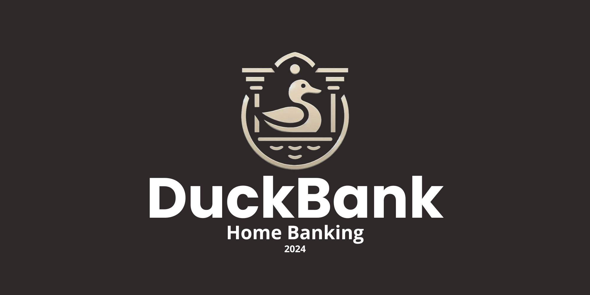

# Certificación Avanzada en Full Stack Developer - ITBA - 2024

## 🧭 Introducción

**DuckBank** es un sistema de *home banking* desarrollado como proyecto final de la **Certificación Avanzada en Full Stack Developer** del ITBA.  
Durante el programa, el equipo diseñó y construyó un banco digital ficticio con enfoque en **usabilidad, seguridad y arquitectura full stack moderna**.

El proyecto se desarrolló en **8 sprints** bajo metodología **ágil (Scrum)**, abordando todos los ejes de formación del curso: desarrollo front-end, back-end, bases de datos y APIs.

👨‍💻 **Equipo de desarrollo**
- Carlos José Castro Galante  
- Celina Bono  
- Ignacio Iannino  

---

## 🧩 Metodología de Trabajo

📆 **Duración total:** 8 sprints (aprox. 4 meses)  
👥 **Modalidad:** Trabajo en equipo con acompañamiento de Tech Lead y RRHH  
⚙️ **Metodología:** Scrum con entregas incrementales con MVP funcional por sprint  
⏱️ **Dedicación semanal:**  
- 6 h de clases sincrónicas  
- 6 h de desarrollo asincrónico  
🧠 **Soft Skills Workshops (mensuales):**
- Future Thinking & Future Skills  
- Business Agility  
- Generative AI Applications  
- Organización y productividad digital  

---

## 🚀 Desarrollo del Proyecto

El proyecto DuckBank siguió una estructura de **8 sprints**, cada uno representando una unidad temática con un objetivo técnico y funcional definido.  
A continuación se detalla el contenido y los aprendizajes de cada uno:

---

### 🏁 Sprint 1 — *Introducción a la Web*
**Temas:** HTML, CSS, JavaScript, DOM, Arreglos, Objetos, JSON  
**Objetivo:** Crear las primeras interfaces del sistema y sentar las bases del front-end.  

**✅ Contenidos clave:**
- Estructura y semántica de páginas web.  
- Estilos avanzados con CSS (selectores, jerarquías, flexbox).  
- Manipulación dinámica del DOM con JavaScript.  
- Uso de estructuras de datos (arrays, objetos) y formato JSON.  

---

### ⚛️ Sprint 2 — *Desarrollo Front-End con ReactJS*
**Temas:** Componentes, props, estados, JSX, React Context, SPA, React Router, UI/UX.  
**Objetivo:** Construir una *Single Page Application* (SPA) para el sistema de home banking.  

**✅ Contenidos clave:**
- Componentes reutilizables y modularización.  
- Manejo de estados locales y globales (Context API).  
- Navegación con React Router.  
- Diseño centrado en la experiencia de usuario.  

---

### 🚀 Sprint 3 — *Optimización con Next.js*
**Temas:** Rendering (SSR, SSG), Fetching, Dynamic Routing, SEO, Performance.  
**Objetivo:** Mejorar el rendimiento y la indexación del sistema.  

**✅ Contenidos clave:**
- Renderizado estático y dinámico.  
- Fetching de datos con rutas dinámicas.  
- Optimización SEO y mejora de tiempo de carga.  
- Estrategias de rendimiento y caching.  

---

### 🐍 Sprint 4 — *Introducción a Python*
**Temas:** Estructuras de control, funciones, tipos de datos complejos, manejo de archivos.  
**Objetivo:** Desarrollar la base lógica del back-end.  

**✅ Contenidos clave:**
- Condicionales, bucles y funciones modulares.  
- Uso de listas, diccionarios y tuplas.  
- Lectura y escritura de archivos.  
- Primeros ejercicios de lógica de negocio.  

---

### 🧱 Sprint 5 — *Programación Orientada a Objetos (POO)*
**Temas:** Módulos, paquetes, manejo de errores, POO, herencia, polimorfismo, pruebas unitarias.  
**Objetivo:** Implementar una lógica robusta, modular y testeable.  

**✅ Contenidos clave:**
- Encapsulamiento y modularización del código.  
- Clases para usuarios, cuentas, préstamos y tarjetas.  
- Aplicación de herencia y polimorfismo.  
- Ejecución de pruebas unitarias automatizadas.  

---

### 🗃️ Sprint 6 — *Bases de Datos y SQL*
**Temas:** Consultas, Joins, subconsultas, transacciones, CASE, Views, índices, triggers.  
**Objetivo:** Diseñar y administrar la base de datos del sistema.  

**✅ Contenidos clave:**
- Modelado relacional de entidades (usuarios, cuentas, préstamos, movimientos).  
- Operaciones CRUD y consultas avanzadas.  
- Control de integridad referencial y transacciones.  
- Creación de vistas e índices para optimización.  

---

### 🧩 Sprint 7 — *Desarrollo Back-End con Django*
**Temas:** ORM, arquitectura MVC, modelos, clases, formularios, sesiones, autenticación, seguridad.  
**Objetivo:** Construir el servidor web y conectar el back-end con la base de datos.  

**✅ Contenidos clave:**
- Creación de modelos, clases y vistas controladoras.  
- Formularios, validaciones y autenticación de usuarios.  
- Manejo de sesiones y middleware de seguridad.  
- Integración con el ORM de Django.  

---

### 🔗 Sprint 8 — *APIs REST con Django REST Framework (DRF)*
**Temas:** Endpoints POST, GET, PUT, DELETE, autenticación, relaciones, serialización.  
**Objetivo:** Integrar el front-end con el back-end mediante una API RESTful completa.  

**✅ Contenidos clave:**
- Creación de endpoints CRUD.  
- Autenticación mediante tokens.  
- Relaciones entre modelos (OneToMany, ManyToMany).  
- Pruebas de endpoints con Postman.  

---

## 🧠 Lógica y Estructura del Sistema

- Implementación de **estructuras de datos** (arrays, objetos, colecciones).  
- Uso de **estructuras de control de flujo** para validaciones y operaciones.  
- Modularización y reutilización de componentes en React.  
- **Eventos** y **estado reactivo** para interactividad en tiempo real.  
- **Operaciones CRUD** para persistencia de datos.  
- **Comunicación cliente-servidor** vía API RESTful.  
- Procesamiento de datos con métodos de iteración (`map`, `filter`, `reduce`).  
- Interfaz responsive con feedback visual y validaciones dinámicas.  

---

## 🧾 Funcionalidades de Sistema

- 🔐 Registro e inicio de sesión con autenticación segura.  
- 💰 Consulta de saldos y movimientos con animación y persistencia de datos.
- 🔄 Transferencias entre cuentas propias o de terceros mediante CBU o Alias (User).
- 📜 Historial de transferencias realizadas o recibidas, con persistencia de datos.
- 💳 Solicitud y cancelación de préstamos o tarjetas.  
- 🏠 Edición de datos personales. 
- 📊 Panel financiero con resumen general.  
- 💳 Consulta automática de tarjeta asociada a la cuenta al registrarse, con persistencia en base de datos.  
- ✨ Dinamismo y animaciones en diferentes funciones y características.  
- ⚠️ Validaciones de errores en formularios para mejorar la experiencia del usuario.  
- 🌐 Estado actual del servidor en tiempo real.  
- 🎲 CBU asignado automáticamente con datos aleatorios, con persistencia de datos.  
- 🏦 Asignación de sucursal según la provincia elegida, con persistencia de datos.
- 🗑️ Solicitud y eliminación permanente de cuenta, con borrado total de datos personales y financieros.

---

## 🧰 Tecnologías y Herramientas

**Frontend:**  
`HTML5` · `CSS3` · `JavaScript (ES6+)` · `ReactJS` · `Next.js`

**Backend:**  
`Python` · `Django` · `Django REST Framework (DRF)`

**Base de Datos:**  
`SQL`

**Herramientas:**  
`Git` · `GitHub` · `Visual Studio Code` · `Postman` · `Vercel`  
`Metodologías Ágiles` · `Scrum` · `CI/CD`  

---

## 🧑‍💼 Competencias Blandas

Durante la certificación también se realizaron talleres de desarrollo profesional:  
- **Future Thinking & Future Skills** – preparación para el futuro laboral.  
- **Business Agility** – adaptación a entornos dinámicos.  
- **Generative AI** – aplicaciones modernas en desarrollo.  
- **Gestión del tiempo y productividad digital.**  

---

## 🎓 Conocimientos Adquiridos

- Diseño e implementación de **interfaces web responsivas**.  
- Desarrollo de **aplicaciones SPA** con React y Next.js.  
- Creación y administración de **bases de datos SQL**.  
- Construcción y consumo de **APIs RESTful**.  
- Programación **orientada a objetos** y pruebas unitarias.  
- Trabajo colaborativo bajo **metodologías ágiles**.  

---

## 🧩 Resultado Final

El resultado fue un sistema completo de **home banking moderno**, con arquitectura **Full Stack**, enfoque en la **seguridad**, **eficiencia** y **experiencia del usuario**.

> 💡 *“DuckBank combina fundamentos sólidos de programación, diseño modular y herramientas actuales del desarrollo web profesional.”*

*💡 Nota Académica: Este proyecto aborda de manera completa y práctica todos los contenidos de Programación I, incluyendo variables, estructuras de control, funciones, arreglos, objetos, manipulación del DOM, eventos, estructuras de datos simples (listas, pilas, colas) y pruebas unitarias.*
